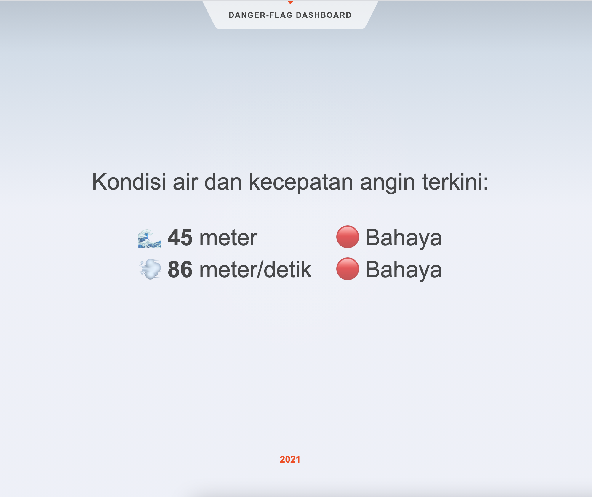

# DangerFlag-Dashboard

Dasboard page to call [`dangerFlag`](https://github.com/kaleemubarok/dangerFlag) API, powered by [`create-svelte`](https://github.com/sveltejs/kit/tree/master/packages/create-svelte);


## Running Project

Once you've clone this repository and installed dependencies with `npm install` (or `pnpm install` or `yarn`), start a development server:

```bash
npm run dev

# or start the server and open the app in a new browser tab
npm run dev -- --open
```

You can access dashboard page on http://localhost:3000

